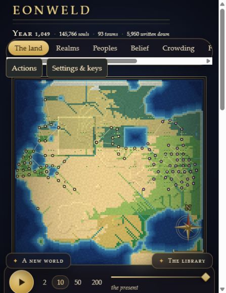
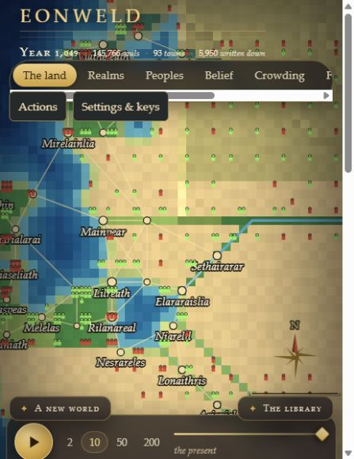
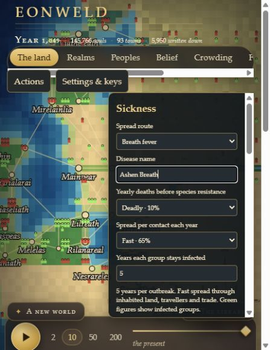
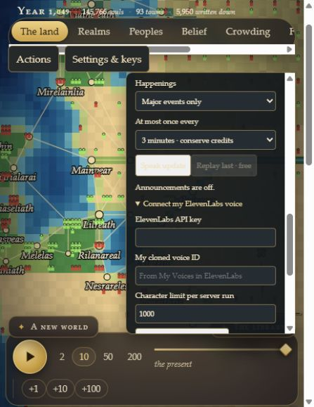
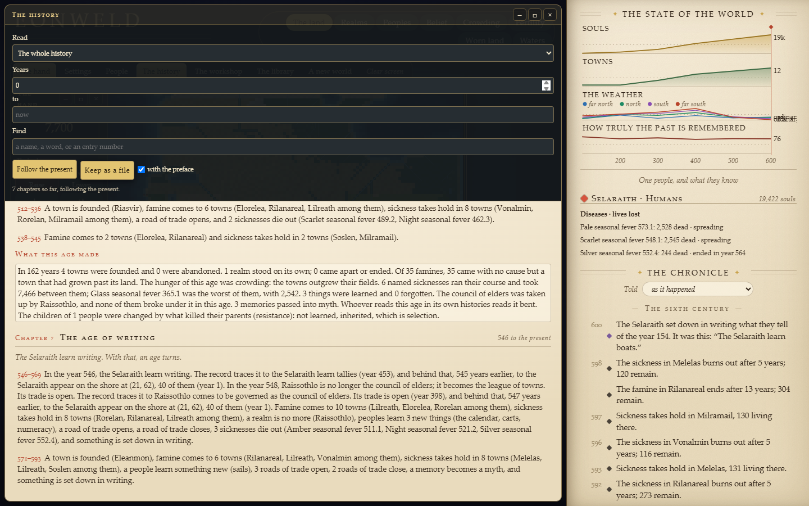
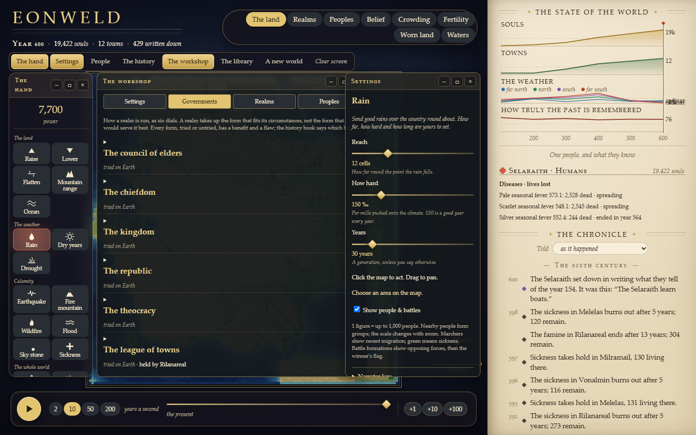

# Eonweld

### Shape a world. Watch its people make history.

Eonweld is a playable god game about land, intelligent life, and consequences across centuries. Draw a mountain range, open an ocean, bring a new people into the world, and watch cultures migrate, trade, fight, remember, and forget.

**Created with AI, directed and play-tested by Nick Mokashi.** This repository is a showcase of the local game, not a source-code or downloadable game release.

## Actual gameplay

These are unaltered screenshots captured while playing a separate test world. No concept art or simulated interface images. At year 1,049, this world held 145,766 people in 93 towns, including humans and dwarves. It had already experienced regional terrain changes, permanent flooding and disease.

<table>
<tr>
<td width="50%"></td>
<td width="50%"></td>
</tr>
<tr><td><strong>A world with a past.</strong> Towns and routes grow across the land you shape.</td><td><strong>People on the map.</strong> In this close view, one figure represents up to 200 people. Green figures mark sickness. The in-game key changes with zoom and density.</td></tr>
</table>

## What you can do

- **Mold whole regions.** Raise, lower or flatten land and water using broad strokes or rectangular selections. Draw mountain ranges and carve oceans, with an area and power preview before applying.
- **Release lasting floods.** Pick their scope and depth, see the price, and leave permanent water behind. Raise the basin again to reclaim it.
- **Create intelligent peoples.** Name and place humans, elves, dwarves, orcs and giants. These five species differ in visible proportions, food needs, growth, disease resistance and combat. A suggested-site marker makes placement easier.
- **Design named diseases.** Choose breath, water or close-contact spread, mortality, contagiousness and duration. Disease follows inhabited land, migration and trade. Each outbreak has its own direct-death total and a recorded ending.
- **Watch migration and conquest.** Population groups and marching trails represent real transfers. Battle formations show opposing forces and the winner; conquered towns change ownership.
- **See societies change their land.** Crowding, extraction and war strip vegetation and exhaust soil. Stewardship and abandonment allow recovery. Long-damaged slopes erode into lowlands, changing height and drainage. Vegetation is visible on the ordinary map, with significant changes recorded in the chronicle.

<table>
<tr>
<td width="50%"></td>
<td width="50%"></td>
</tr>
<tr><td><strong>Your disease, your settings.</strong> Outcomes depend on the people and connections it reaches.</td><td><strong>Your voice, optional.</strong> Announcements start off. The game works without either API service.</td></tr>
</table>

## A history book, written as it happens

Every world keeps one continuous history, written from its own record from year one and extended as time runs. It is divided into ages that turn on real turnings (a first realm, a great fall, a stone from the sky, a people learning to write), and each age closes with conclusions drawn from the recorded chains of cause: how many of its famines followed drought, who won its wars, under which forms of rule the revolts came. What a state claimed and what a people remember are set apart from what happened, because in this world every bend in a telling is itself a recorded event. Read any age or any span of years, find an event by name or number, and keep any part of it as a text file.

<table>
<tr>
<td width="50%"></td>
<td width="50%"></td>
</tr>
<tr><td><strong>The book at year 600.</strong> Seven chapters so far, following the present. The conclusions are arithmetic over the record; no model writes any of it.</td><td><strong>Every hand adjustable.</strong> Reach, strength and years for the weather; a stone's size; how many a new people are. Every window stays where you put it while you act.</td></tr>
</table>

## Governments, peoples and the world's settings

- **Fifteen forms of rule, seven never tried.** Each is six dials (who takes part, how much is decided at the centre, how much is given back, how much is known, how much is done by force, how readily it changes). A realm comes to the form that fits its circumstances, and every form buys something and costs something: cohesion, how many it can govern, how wealth gathers, what the treasury takes, how hard it fights, how likely a revolt is, how much its own records lie. Trade follows the form: open, taxed, or shut. The workshop lets you charter a form of your own design; the world decides who takes it up.
- **Peoples that change.** Each people carries inherited figures and a temper. Where a sickness, a hunger or a war really kills, the survivors' children are a little better at surviving it: one small step a generation, never far from where they began. Two peoples alike enough and open enough become one; alike enough to bear children but not the same, they bear a people who are neither; too unlike and quick to fight, they feud. The book's preface says how, and names the science it leans on.
- **The world's settings by decree.** How dark a stone makes the sky and for how long, the most a sickness may kill, whether a beaten people are destroyed or thinned, whether the last handful of a people can dwindle, whether a people under catastrophe may find a new way to live. Each is recorded, so a replay reads the same world.
- **Three hands on the whole world.** The sea rising or falling, the whole sky warmed or cooled, fire from the sky.

## History you can inspect

The chronicle stores observed events and their causes. What actually happened stays distinct from what a culture remembers. Within a rules version, the same seed and actions replay the same history. Saved worlds continue across updates from a preserved rules boundary.

Landscape priorities are a game abstraction based on institutions, inequality, population pressure and recent war. They are not an AI judgment of a species or culture. Figures aggregate people; battle formations illustrate recorded outcomes rather than individually simulated soldiers.

## Optional AI and voice

- **Anthropic:** add your own API key in Settings & keys → Narrator key for optional tellings. Ordinary play needs no model calls.
- **ElevenLabs:** enter your own API key and existing cloned voice ID under Voice announcements. There is also a device voice option that uses no ElevenLabs credits.
- Announcements use short templates of actual world events, with no extra AI writing request. Defaults are major events at most once every three minutes, at most 320 characters per update, and a hard 1,000-character allowance shared across the server run.
- Replay uses cached audio. Failed requests are counted conservatively and do not automatically retry. Actual credit charges depend on the provider plan and voice.
- Keys and cached speech stay in server memory; they are not written into world saves. A key entered in the game lasts until the server closes; to keep them across restarts, set them once in your own environment (`ANTHROPIC_API_KEY`, `ELEVENLABS_API_KEY`, `ELEVENLABS_VOICE_ID`), where the game reads them at start and never writes them.
- Choosing a voice speaks the latest news at once, then at most once per interval while time runs. "In whose words" lets the voice read the narrator's own line about the weightiest new thing, as a metered telling, instead of the record's plain words.
- The act chip in the dock always says what clicking the map does now, with the settings already chosen, and carries the Apply button, so every window can be closed without losing the act in hand.

## Release status

Local playable build, rules **13.0**, September 24, 2026. This showcase is prepared for review; source-code publication and a public game download are separate future decisions. No API credentials, player save files, or private development records are included here.

Provider connections were verified with local test doubles to avoid paid calls. Live cloned-voice quality has not been tested with a real key.
